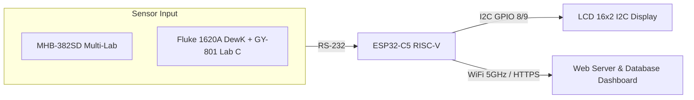

# 🌦️ IoT Real-Time Weather Station Monitoring System (ESP32-C5 & ESP8266)

[](https://www.espressif.com/)
[](https://www.wi-fi.org/)
[](https://www.arduino.cc/)
[](#)
[](#)

> **Dokumentasi & Panduan Proyek Migrasi Weather Station Real-Time dari ESP8266 ke ESP32-C5 Dual-Band WiFi 6**  
> Disusun oleh: **M. Yusuf Akram** & **M. Rival** (Siswa PKL — SMK Alfalah, 2026)

---

## 📌 Daftar Isi
- [Latar Belakang & Tujuan](#-latar-belakang--tujuan)
- [Perbandingan Mikrokontroler (ESP8266 vs ESP32-C5)](#-perbandingan-mikrokontroler-esp8266-vs-esp32-c5)
- [Skema Perangkat Keras & Wiring](#-skema-perangkat-keras--wiring)
  - [1. Wiring LCD 16x2 I2C](#1-wiring-lcd-16x2-i2c-alamat-default-0x27)
  - [2. Wiring Sensor MHB-382SD (Lab A, B, D, E, K46)](#2-wiring-sensor-mhb-382sd-lab-a-b-d-e-k46)
  - [3. Wiring Khusus LAB C: Fluke 1620A & Barometer GY-801](#3-wiring-khusus-lab-c-fluke-1620a-dewk--barometer-gy-801-bmp085)
- [Fitur Utama & Inovasi Teknis](#-fitur-utama--inovasi-teknis)
  - [1. Koneksi Paksa WiFi 5GHz (BSSID Scanning)](#1-koneksi-paksa-wifi-5ghz-bssid-scanning)
  - [2. Parsing Data Sensor Berbasis Kode Satuan (Anti Tertukar)](#2-parsing-data-sensor-berbasis-kode-satuan-anti-tertukar)
  - [3. Integrasi Standar Kalibrasi Fluke 1620A (Khusus Lab C)](#3-integrasi-standar-kalibrasi-fluke-1620a-khusus-lab-c)
  - [4. Auto-Recovery Bus I2C & Tampilan LCD Stabil](#4-auto-recovery-bus-i2c--tampilan-lcd-stabil)
  - [5. Validasi Data Sensor & HTTPS Resilient](#5-validasi-data-sensor--https-resilient)
- [Struktur File Proyek](#-struktur-file-proyek)
- [Panduan Penggunaan & Konfigurasi](#-panduan-penggunaan--konfigurasi)
- [Deployment Multi-Lab (Lab A - E & Lab K46)](#-deployment-multi-lab)
- [Catatan Troubleshooting & Solusi Bug](#-catatan-troubleshooting--solusi-bug)
- [Lisensi & Kontributor](#-lisensi--kontributor)

---

## 📖 Latar Belakang & Tujuan

### Latar Belakang
Sistem **Weather Station LAB** merupakan sistem pemantauan kondisi lingkungan laboratorium kalibrasi berbasis IoT secara real-time. Sistem ini membaca parameter cuaca (**Suhu / Temperature**, **Kelembapan / Relative Humidity**, dan **Tekanan Udara / Barometric Pressure**) dari sensor presisi tinggi (MHB-382SD dan standar kalibrasi thermo-hygrometer **Fluke 1620A "DewK"**) lalu menampilkannya pada layar LCD 16x2 I2C serta mengirimkannya ke database web dashboard via HTTPS.

Pada versi awal, sistem menggunakan **ESP8266 (NodeMCU/Wemos D1 Mini)** dengan pita WiFi 2.4GHz. Namun, seiring tingginya interferensi sinyal 2.4GHz di area laboratorium, muncul kebutuhan untuk menghubungkan perangkat ke jaringan **WiFi 5GHz**. Karena ESP8266 tidak mendukung frekuensi 5GHz secara hardware, dilakukan migrasi penuh ke **ESP32-C5**, chip RISC-V pertama dari Espressif yang mendukung **WiFi 6 Dual-Band (2.4GHz & 5GHz)**.



### Tujuan Proyek
1. Memigrasikan seluruh fungsionalitas weather station ke ESP32-C5 tanpa kehilangan fitur yang ada.
2. Mengaktifkan koneksi ke jaringan WiFi 5GHz guna meminimalkan interferensi dan latensi pengiriman data.
3. Memperbaiki akurasi parsing paket serial sensor (MHB-382SD & Fluke 1620A) agar data suhu, kelembapan, dan tekanan tidak pernah tertukar.
4. Mendukung integrasi thermo-hygrometer standar kalibrasi **Fluke 1620A "DewK"** khusus untuk **LAB C**.
5. Menerapkan mekanisme pemulihan otomatis (*auto-recovery*) pada bus I2C LCD dan koneksi jaringan.
6. Mempermudah replikasi sistem untuk berbagai laboratorium (Lab A hingga E dan Lab K46).

---

## ⚡ Perbandingan Mikrokontroler (ESP8266 vs ESP32-C5)

| Spesifikasi | ESP8266 (Legacy) | ESP32-C5 (Generasi Baru) | Keuntungan ESP32-C5 |
| :--- | :--- | :--- | :--- |
| **Arsitektur CPU** | Tensilica L106 32-bit Single-Core | RISC-V 32-bit Single-Core + Low-Power Core | Arsitektur modern, efisiensi energi tinggi |
| **Clock Speed** | 80 – 160 MHz | Hingga 240 MHz | Pemrosesan paket serial lebih responsif |
| **Memori RAM** | 32 KB + 80 KB | 384 KB SRAM (+ Dukungan PSRAM) | Kapasitas buffer & SSL/TLS stack lebih lega |
| **Konektivitas WiFi** | 802.11 b/g/n (2.4GHz saja) | **WiFi 6 Dual-Band (2.4GHz & 5GHz)** | Koneksi stabil di lab minim interferensi |
| **Bluetooth / IoT** | Tidak ada | Bluetooth 5 (LE) + IEEE 802.15.4 (Zigbee/Thread)| Dukungan protokol IoT masa depan |
| **Port Serial (UART)**| 1 HW UART (Pakai `SoftwareSerial`) | **Native HardwareSerial (Serial1, Serial2)** | Tidak membebani CPU, buffer aman |
| **Jumlah GPIO** | 17 Pin (Banyak multiplexing) | Hingga 29 Pin yang dapat diprogram | Penataan pin I2C & Serial lebih fleksibel |

---

## 🔌 Skema Perangkat Keras & Wiring

<p align="center">
  
  <br><em>Modul ESP32-C5 DevKit</em>
</p>

### 1. Wiring LCD 16x2 I2C (Alamat Default: `0x27`)
> **PENTING**: Pada ESP32-C5, jangan gunakan GPIO 6 & 7 untuk I2C karena dialokasikan untuk sistem internal (*strapping pins*). Gunakan **GPIO 8 (SDA)** dan **GPIO 9 (SCL)**.

| Kabel | Fungsi | ESP8266 (Lama) | ESP32-C5 (Final) | Catatan |
| :--- | :--- | :--- | :--- | :--- |
| **Hijau** | SCL (Clock) | D1 (GPIO 5) | **GPIO 9** | Bus I2C Hardware Wire |
| **Biru** | SDA (Data) | D2 (GPIO 4) | **GPIO 8** | Bus I2C Hardware Wire |
| **Putih** | VCC | VIN | **5V** | LCD I2C toleran terhadap 5V |
| **Hitam** | GND | GND | **GND** | Ground bersama |

---

### 2. Wiring Sensor MHB-382SD (Lab A, B, D, E, K46)
Sensor MHB-382SD bersifat *one-way stream* (hanya memancarkan data TX tanpa menerima perintah):

| Kabel | Fungsi | ESP8266 (Lama) | ESP32-C5 (Final) | Catatan |
| :--- | :--- | :--- | :--- | :--- |
| **Merah** | TX Sensor → RX MCU | D5 (GPIO 14) | **GPIO 4 (RX1)** | Masuk ke pin RX HardwareSerial1 |
| **Putih** | VCC | 3V3 | **3V3** | Sumber daya 3.3V terisolasi |
| **Tembaga / Shield** | GND | GND | **GND** | Ground proteksi noise |

---

### 3. Wiring Khusus LAB C: Fluke 1620A "DewK" & Barometer GY-801 (BMP085)
Khusus untuk **LAB C**, pengukuran suhu dan kelembapan menggunakan thermo-hygrometer standar kalibrasi **Fluke 1620A "DewK"**, sedangkan tekanan udara diukur menggunakan sensor **GY-801 (BMP085/BMP180)** melalui jalur I2C:

#### A. Kabel Serial Fluke 1620A (Jack Audio 3.5 mm ke RS-232 / Serial MCU):
| Pin Jack 3.5 mm | Sinyal Fluke | ESP32-C5 Pin | Keterangan |
| :--- | :--- | :--- | :--- |
| **Tip** | TX Fluke Out | **GPIO 4 (RX1)** | Data serial auto-print dari Fluke masuk ke ESP32 |
| **Ring** | RX Fluke In | **GPIO 5 (TX1)** | Command / Query line (opsional) |
| **Sleeve** | GND | **GND** | Ground bersama |

#### B. Sensor Tekanan Udara Barometer GY-801 (BMP085):
| Pin GY-801 / BMP085 | ESP32-C5 Pin | Keterangan |
| :--- | :--- | :--- |
| **VCC** | **3V3** | Tegangan referensi 3.3V |
| **GND** | **GND** | Ground |
| **SDA** | **GPIO 8** | Paralel pada jalur bus I2C LCD |
| **SCL** | **GPIO 9** | Paralel pada jalur bus I2C LCD |

<p align="center">
  
  <br><em>Implementasi Fisik Weather Station & Tampilan LCD</em>
</p>

---

## 🚀 Fitur Utama & Inovasi Teknis

### 1. Koneksi Paksa WiFi 5GHz (BSSID Scanning)
Untuk memastikan ESP32-C5 terhubung ke frekuensi 5GHz pada router dual-band yang memiliki SSID sama:
* Melakukan `WiFi.scanNetworks()` untuk memindai seluruh *Access Point*.
* Memfilter Access Point dengan SSID yang cocok dan memiliki **Channel $\ge$ 36** (frekuensi eksklusif 5GHz).
* Mengunci koneksi langsung menggunakan BSSID fisik router via `WiFi.begin(ssid, password, channel, bssid)`.
* Memiliki mekanisme *fallback* otomatis ke 2.4GHz jika sinyal 5GHz tidak terjangkau.

### 2. Parsing Data Sensor Berbasis Kode Satuan (Anti Tertukar)
Sensor MHB-382SD mengirim 3 paket berurutan: **Kelembapan (RH)**, **Suhu (Temp)**, dan **Tekanan (Bar)**. Parsing berdasarkan urutan posisi sering membuat data tertukar saat mikrokontroler menyala di tengah transmisi.

**Solusi Algoritma**:  
Setiap paket berukuran 14-byte yang diawali `0x02` (STX) membaca kode satuan 4-karakter pertama:
* **Kode `41xx`** $\rightarrow$ Kelembapan (RH)
* **Kode `42xx`** $\rightarrow$ Suhu (Temperature)
* **Kode `43xx`** $\rightarrow$ Tekanan (Barometer)

Data hanya dikirim ke server jika ketiga paket (`bufRH`, `bufTemp`, `bufBar`) telah diterima lengkap dan valid dalam siklus yang sama.

### 3. Integrasi Standar Kalibrasi Fluke 1620A (Khusus Lab C)
Khusus pada Lab C, sistem mampu mengolah data stream auto-print presisi tinggi dari Fluke 1620A DewK:
```text
Raw Stream: "07-23-2026 08:31:30, 23.19,C,  50.5,%,       0,C,       0,%"
             └── Datetime ──────┘ └──T──┘└┘  └──RH─┘└┘  └── CH2 (0/Skip) ──┘
```
Parser otomatis mengekstrak nilai suhu dan kelembapan presisi tinggi, lalu menggabungkannya dengan nilai tekanan barometer dari modul sensor BMP085 (GY-801) sebelum dikirimkan ke server.

### 4. Auto-Recovery Bus I2C & Tampilan LCD Stabil
* **Throttling Update**: Tampilan LCD diperbarui setiap 500 ms (non-blocking) untuk mencegah *bus saturation*.
* **Reinit Post-Scan**: Bus I2C di-reset ulang via `Wire.end()` dan `Wire.begin()` setelah proses pemindaian WiFi 5GHz yang intensif.
* **Auto-Reinit Berkala**: Refresh bus I2C otomatis setiap 60 detik untuk mencegah LCD freeze/glitch akibat induksi listrik atau senggolan kabel USB.
* **Signal Meter & MAC Viewer**: Menampilkan ikon sinyal RSSI kustom serta MAC Address perangkat saat pertama kali menyala.

### 5. Validasi Data Sensor & HTTPS Resilient
* Dilengkapi *range filtering* sebelum dikirim ke server:
  * Suhu: $10^\circ\text{C} \le T \le 35^\circ\text{C}$
  * Kelembapan: $35\% \le RH \le 90\%$
  * Tekanan: $800 \text{ hPa} \le P \le 1100 \text{ hPa}$
* Timeout `HTTPClient` diatur ke **10.000 ms (10 detik)** untuk mencegah kegagalan pengiriman pada kondisi hotspot/jaringan fluktuatif.

---

## 📁 Struktur File Proyek

```text
MONITORING_ESP32C5_REALTIME/
├── aboutProject.txt                       # Catatan dokumentasi & log detail migrasi
├── config.h                               # Template konfigurasi WiFi, Host & Interval
├── ESP32-C5_WeatherStation_LAB_K46-FIX.ino # Kode implementasi utama (LAB K46)
├── ESP32-C5_ALL_LABS_MASSA.ino            # Versi multi-lab dengan FreeRTOS Queue HTTP Task
├── ESP32-C5_WeatherStation_LAB_A.ino      # Versi deploy khusus Lab A (MHB-382SD)
├── ESP32-C5_WeatherStation_LAB_B.ino      # Versi deploy khusus Lab B (MHB-382SD)
├── ESP32-C5_WeatherStation_LAB_C.ino      # Versi deploy khusus Lab C
├── ESP32-C5_WeatherStation_LAB_D.ino      # Versi deploy khusus Lab D (MHB-382SD)
├── ESP32-C5_WeatherStation_LAB_E.ino      # Versi deploy khusus Lab E (MHB-382SD)
├── ESP32_C5_FIX_FLUKE_HYGROMETER.ino      # Implementasi Lab C (Fluke 1620A DewK + GY-801 BMP085)
├── LAB_K46_Fluke1620A.ino                 # Varian lanjutan Fluke 1620A
├── WifiCrashDebugExample.sh               # Skrip debug analisa crash wifi
├── ESP8266/
│   └── TA_Kode_program_LAB_E_fixed.ino    # Source code sistem versi ESP8266 lama
└── README.md                              # Dokumentasi proyek (file ini)
```

---

## 🛠️ Panduan Penggunaan & Konfigurasi

### 1. Kebutuhan Perangkat Lunak
* **Arduino IDE 2.x** atau **VS Code + PlatformIO**
* Board Package: **esp32 by Espressif Systems** (versi yang mendukung ESP32-C5)
* Library yang dibutuhkan:
  * `LiquidCrystal_I2C` (by Frank de Brabander)
  * `Adafruit_BMP085` (khusus varian Fluke Lab C)
  * `Wire` (bawaan ESP32)
  * `WiFi` & `WiFiClientSecure` (bawaan ESP32)
  * `HTTPClient` (bawaan ESP32)

### 2. Pengaturan di Arduino IDE
1. Pasang kabel data USB ke ESP32-C5.
2. Buka Arduino IDE $\rightarrow$ **Tools** $\rightarrow$ **Board** $\rightarrow$ pilih **ESP32C5 Dev Module**.
3. Pilih **Port COM** yang terdeteksi.
4. Set **Upload Speed**: `921600` atau `115200`.

### 3. Konfigurasi Kode Program
Buka file target sesuai laboratorium tujuan, lalu sesuaikan konfigurasi jaringan jika diperlukan:

```cpp
// Konfigurasi Kredensial WiFi & Server
const char* ssid     = "NAMA_WIFI_ANDA";
const char* password = "PASSWORD_WIFI";
const char* host     = "domain-server-anda.com";
const String path    = "/path/ke/endpoint/kirimdataX.php";
```

4. Klik tombol **Upload** (Ctrl+U).
5. Buka **Serial Monitor** pada baudrate `115200` untuk memantau log pembacaan sensor dan status pengiriman data.

---

## 🏢 Deployment Multi-Lab

Berikut daftar pemetaan endpoint dan jenis sensor yang digunakan pada masing-masing laboratorium:

| Laboratorium | Sensor yang Digunakan | File Sketch Target | Endpoint Server Target | Status |
| :--- | :--- | :--- | :--- | :--- |
| **Lab A** | MHB-382SD | `ESP32-C5_WeatherStation_LAB_A.ino` | `/WIQHJKEQBPSUML123/datakirim/kirimdata1.php` | Siap Deploy |
| **Lab B** | MHB-382SD | `ESP32-C5_WeatherStation_LAB_B.ino` | `/WIQHJKEQBPSUML123/datakirim/kirimdata2.php` | Siap Deploy |
| **Lab C** | **Fluke 1620A "DewK" + GY-801 (BMP085)** 🏆 | `ESP32_C5_FIX_FLUKE_HYGROMETER.ino` / `ESP32-C5_WeatherStation_LAB_C.ino` | `/WIQHJKEQBPSUML123/datakirim/kirimdata3.php` | Siap Deploy |
| **Lab D** | MHB-382SD | `ESP32-C5_WeatherStation_LAB_D.ino` | `/WIQHJKEQBPSUML123/datakirim/kirimdata4.php` | Siap Deploy |
| **Lab E** | MHB-382SD | `ESP32-C5_WeatherStation_LAB_E.ino` | `/WIQHJKEQBPSUML123/datakirim/kirimdata5.php` | Siap Deploy |
| **Lab K46** | MHB-382SD | `ESP32-C5_WeatherStation_LAB_K46-FIX.ino` | `/WIQHJKEQBPSUML123/datakirim/kirimdata6.php` | **Aktif Beroperasi ✅** |

---

## 🔍 Catatan Troubleshooting & Solusi Bug

Berikut rangkuran kendala yang ditemukan selama riset migrasi dan solusinya:

| Permasalahan | Akar Penyebab | Solusi yang Diterapkan |
| :--- | :--- | :--- |
| **Port COM Tidak Muncul** | Menggunakan kabel USB *charge-only* (tanpa jalur data). | Ganti dengan kabel data (*sync & charge cable*). |
| **LCD I2C Blank / Freeze** | Bus I2C hang akibat scanning radio WiFi atau spam update di `loop()`. | Batasi update LCD ke 500 ms dan reinit I2C via `Wire.end()` & `Wire.begin()`. |
| **I2C Tidak Terdeteksi di Scanner** | GPIO 6 & GPIO 7 pada ESP32-C5 merupakan pin strapping internal sistem. | Pindahkan SDA ke **GPIO 8** dan SCL ke **GPIO 9**. |
| **Data Suhu & Tekanan Tertukar** | Parser lama mengasumsikan urutan paket serial selalu sama. | Ubah parser menjadi **berbasis kode satuan** (`41xx` RH, `42xx` Temp, `43xx` Bar). |
| **Error `HTTP Read Timeout`** | Default timeout HTTPClient hanya 5 detik; respons server tertunda. | Set timeout secara eksplisit via `http.setTimeout(10000)`. |

---

## 👥 Lisensi & Kontributor

Proyek ini dikembangkan dalam rangka Praktik Kerja Lapangan (PKL):
* **M. Yusuf Akram** — *Developer & Hardware Integration*
* **M. Rival** — *Developer & System Testing*
* **SMK Alfalah** — *2026*

*Didukung oleh Laboratorium Kalibrasi & Tim Teknis Terkait.*
